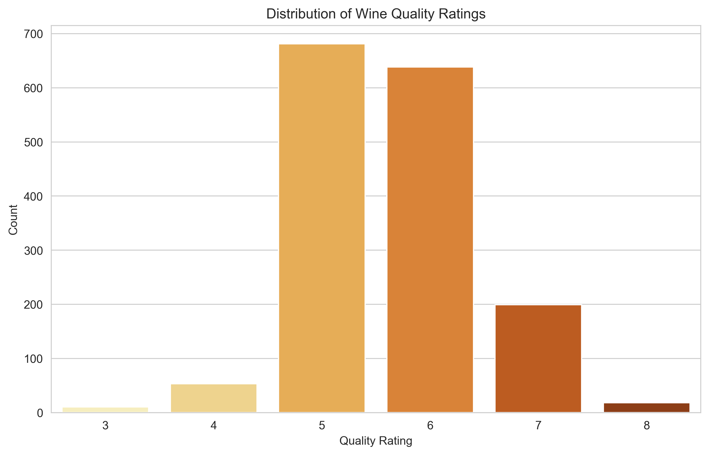
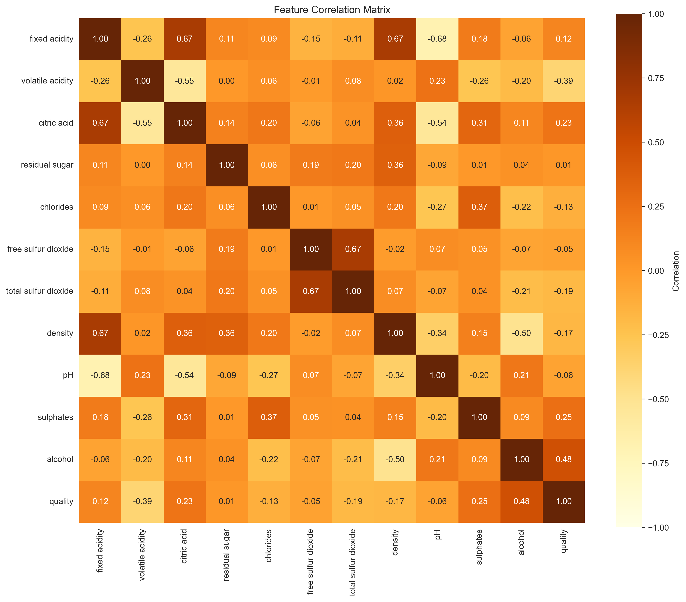
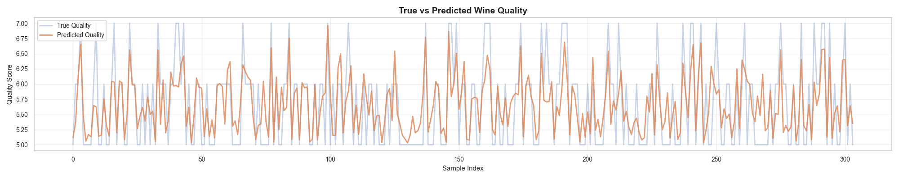
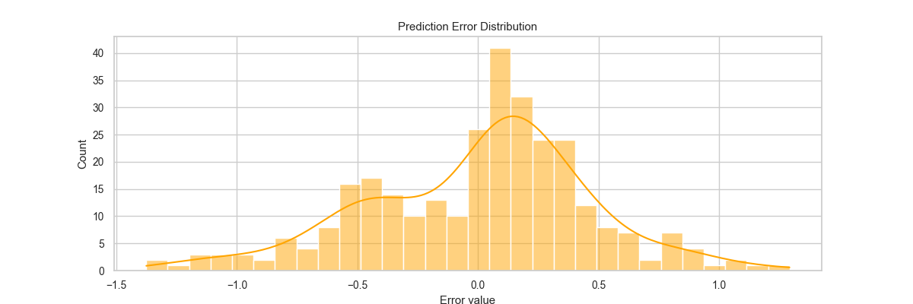

# 🍷 Wine Quality Prediction — ML Pipelines & Feature Engineering

This project predicts the quality of red wine using a fully structured **Machine Learning Pipeline**.  
The goal: build a clean, industry-style workflow.

---

## Project Highlights

- Built **Scikit-Learn pipelines**
- Removed outliers → **+8–10% better R²**
- Added **feature engineering**
- Tuned Random Forest with **RandomizedSearchCV**
- Exported clean visualizations
- Final model achieves:

| Metric | Score |
|-------|-------|
| **MAE** | ~0.40 |
| **RMSE** | ~0.54 |
| **R²** | ~0.56 |

Given wine tasting’s subjectivity, panel bias, and the dataset’s limited size, achieving ~0.56 R² is realistically strong performance for this kind of regression problem.

---

## Exploratory Data Analysis

### Distribution of Wine Quality  


### Correlation Matrix  


**Top correlations with wine quality:**

- **Alcohol** (+0.47)  
- Sulphates (+0.25)  
- Citric acid (+0.22)  
- Volatile acidity (−0.39)

---

## Outlier Removal

Removing extreme quality values improves model performance:

```python
Q1 = df["quality"].quantile(0.05)
Q3 = df["quality"].quantile(0.95)
df_clean = df[(df["quality"] >= Q1) & (df["quality"] <= Q3)]
```

This stabilizes training and reduces target noise.

---

## Feature Engineering

Added domain-driven engineered features:

### **Acid Balance**
```python
fixed acidity / volatile acidity
```

### **Sweetness Index**
```python
residual_sugar / alcohol
```

### **Complexity Index**
A handcrafted weighted metric:
```python
0.4 * fixed_acidity +
0.3 * sulphates +
0.3 * alcohol
```

These increase **signal clarity** for the model.

---

## Modeling & Pipelines

Models tested:

- Linear Regression  
- Ridge, Lasso, ElasticNet  
- Gradient Boosting  
- **Random Forest (winner)**
  
Models were evaluated through a structured dictionary of estimators and hyperparameter search spaces, using RandomizedSearchCV for fair comparison.
Testing code is excluded on purpose, the repo contains only the finalized modeling pipeline for maximum clarity.

### Random Forest hyperparameter tuning

```python
{
 "model__n_estimators": [150, 200, 300, 400],
 "model__max_depth": [None, 8, 10, 12],
 "model__min_samples_split": [2, 5, 10],
 "model__min_samples_leaf": [1, 2, 4]
}
```

---

## Evaluation

### True vs Predicted


### Prediction Error Distribution  


Observations:

- The model reliably predicts mid-range wines
- Higher/lower extremes remain harder (expected due to human-rated noise)

---

## Final Results

| Metric | Score |
|--------|-------|
| **MAE** | ~0.40 |
| **RMSE** | ~0.54 |
| **R²** | ~0.56 |

---

## Tech Stack

- Python 3  
- Pandas, NumPy  
- Scikit-Learn  
- Matplotlib, Seaborn  
- Jupyter Notebook

---
